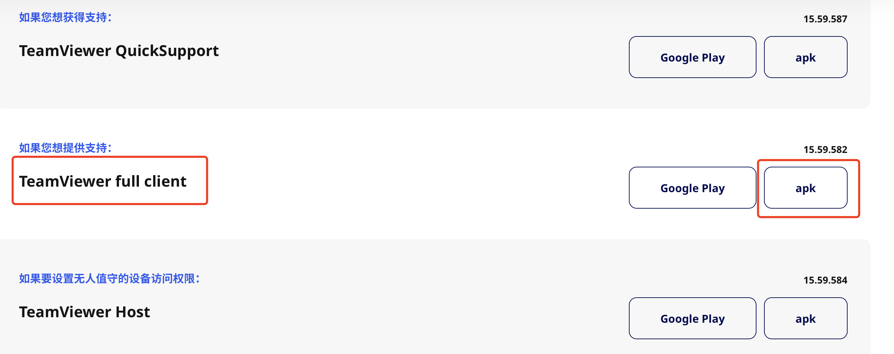
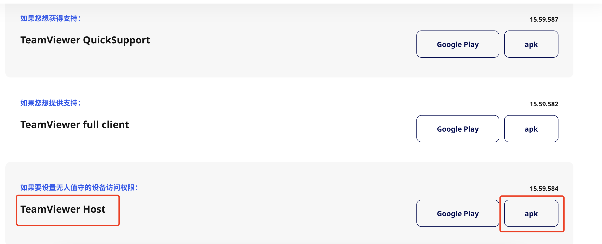
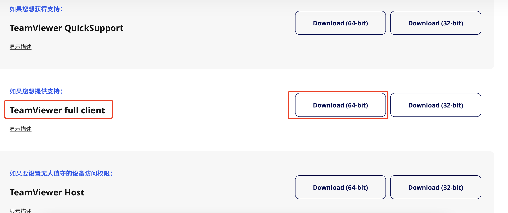
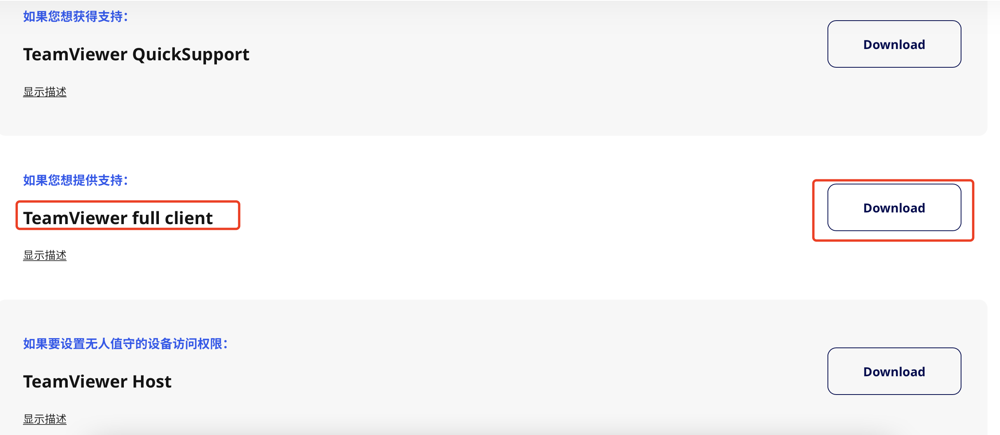
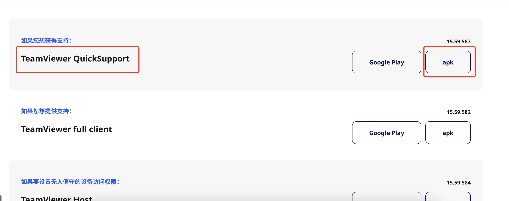

作者：iclause  
联系方式：809016408@qq.com     

  

- [远程控制手机一站式解决方案](#远程控制手机一站式解决方案)
- [一、账号注册](#一账号注册)
- [二、软件下载与使用](#二软件下载与使用)
  - [1、主控制端](#1主控制端)
    - [1.1 Android手机](#11-android手机)
    - [1.2 iOS手机](#12-ios手机)
    - [1.3 Windows电脑](#13-windows电脑)
    - [1.4 Mac电脑](#14-mac电脑)
  - [2、被控制端:](#2被控制端)
    - [2.1 Android手机（推荐）](#21-android手机推荐)
      - [2.1.1 TeamViewer QuickSupport安装](#211-teamviewer-quicksupport安装)
      - [2.1.2 AddOn安装](#212-addon安装)
      - [2.1.3 TeamViewer Host安装](#213-teamviewer-host安装)
      - [2.1.4 权限配置](#214-权限配置)
    - [2.2 iOS手机 （仅可被观测，无法被操控）](#22-ios手机-仅可被观测无法被操控)

   

# 远程控制手机一站式解决方案

# 一、账号注册
   注册地址
   
   https://account.teamviewer.com/register?redirect_uri=https%3A%2F%2Fweb.teamviewer.com%2Fauthenticate%2Fwithtoken

   注册成功后，保存好您的账户信息（电子邮箱，密码）
   

# 二、软件下载与使用   
名词解释：**主控制端**代表主动发起监控的设备，**被控制端**代表被监控的设备。

## 1、主控制端
 首先请根据您的实际情况确定主控制端设备类型，根据如下分类进行选择安装对应的软件。
 
 **主控制端支持Android手机，iOS手机，windows电脑，mac电脑。**
    
### 1.1 Android手机

   https://www.teamviewer.cn/cn/download/android/
    
   找到如图所示，点击下载（不同系统版本手机可能会提示软件风险，选择允许安装）
   

### 1.2 iOS手机

   https://www.teamviewer.cn/cn/download/ios/

   找到如图所示，跳转appstore下载最新版本并安装
   

### 1.3 Windows电脑

   https://www.teamviewer.cn/cn/download/windows/

   找到如图所示，点击下载并安装
   

### 1.4 Mac电脑

   https://www.teamviewer.cn/cn/download/macos/
   
   找到如图所示，点击下载并安装
   

 下载并安装成功后，可使用“步骤一”注册的账号登录，首次登录时会提示信任设备，使用注册的邮箱验证添加信任设备即可（根据提示操作即可，如果这步无法成功请与我联系）

## 2、被控制端:

### 2.1 Android手机（推荐）
   
   如果被控制端是Android系统，需要下载TeamViewer QuickSupport , TeamViewerUniversal Add-On , TeamViewer Host这三个软件
   
   下载地址 https://www.teamviewer.cn/cn/download/android/

   按照以下步骤依次下载安装软件（截图为红米9A测试，其他厂商安卓手机原理类似，如有问题请留言）

   

  #### 2.1.1 TeamViewer QuickSupport安装

    找到如图所示，点击下载，并安装（不同系统版本手机可能会提示软件风险，选择允许安装）

   

  #### 2.1.2 AddOn安装
     
    addon插件需要使用QuickSupport软件辅助下载并激活

   (1) 打开QuickSupport软件
     

      
     

   (2) 点击右上角设置
     

      
     

   (3) 点击权限
     

      
     

   (4) 点击远程控制功能
    

      
     

   (5) 点击安装TeamViewer增值模块，安装成功后进行下一步
    

      
     

    

      
     

    

      
     

    
   (6) 点击启用Universal Add-On
    

      
     

   (7) 点击无障碍功能菜单
    

      
     

   (8) 选择开启，然后点击返回
    

      
     

   (9) 点击已下载的服务
    

      
     

   (10) 点击开启服务
    

      
     

   (11) 选中“我已知晓....”,点击确定
    

      
     

    

  #### 2.1.3 TeamViewer Host安装

   (1) 下载网页中找到TeamViewer Host，如图所示，点击下载（不同系统版本手机可能会提示软件风险，选择允许安装）
     

      
     

   (2) 打开Host软件， 打开一切提示所需的开关，权限。
      

      
     

      

      
     

      
   (3) 登录“步骤一”注册的账号，首次登录需要邮箱认证，添加信任设备（根据提示操作即可，如无法登录请联系我）
    

     
    

  
   (4) 此时打开“步骤二-1”中的主控制端设备（前提：主控制端账号已登录），即可看到被控制端设备
     

      
     

   (5) 点击我的托管设备，正常可以看到被控制端设置（如果里面为空也可以打开我的计算机进行查看）,点击连接图标
     

      
     

     

      
     

   (6) 查看被控制端设备，提示“Host将开始截取屏幕内容”，点击立即开始，**此时远程控制已建立，主控端可以看到并操作被控端屏幕。**
     

      
     

  #### 2.1.4 权限配置
   
   被控制端为Android手机时需设置以下权限，才能保证被控制端长期可以建立连接。否则可能会因为操作系统策略导致软件服务被杀死。   
   
   **开启软件所需权限（以红米9A手机为例）**

  (1) 设置-应用设置-应用管理 （不同Android厂商叫法不同，如找不到可根据经验寻找设置-应用管理模块）
     

      
     

     

      
     

     

      
     

  (2) 搜索host，点击进入
        

         
        

  (3) 开启自启动开关
        

         
        

  (4) 下滑页面，找到省电策略，点击进入，选择“无限制”模式
        

         
        

        

         
        

  (5) 搜索add，点击进入TeamViewer Universal Add-On
        

         
        

  (6)  开启自启动开关
        

         
        

        

### 2.2 iOS手机 （仅可被观测，无法被操控）
  **注意：iOS设备作为被控制端，仅能被查看屏幕，无法被操控。每次连接必须被由被控制端授权同意，否则无法在未授权的情况建立连接。（推荐使用Android设备作为被控制端，部署好后可随时进行连接实现远程控制，无需每次人工进行授权操作）**

  (1) 如果被控制端是IOS，仅需下载TeamViewer QuickSupport
    
   

     
   

  (2) 打开TeamViewer QuickSupport初始化成功后有您的ID 
    

     
    

    

     
    

     

  (3) 此时使用“步骤二-1”中的主控制端设备添加该ID即可进行连接，
     打开主控制端TeamViewer软件
    

     
    

  (4) 点击我的计算机
    

     
    

    
  (5) 添加计算机
    

     
    

    

     
    

     
  (6) 点击连接标志
    

     
    

    

  (7) 打开被控制端QuickSupport软件，会提示授权 
    

     
    

    

     
    

   

  (8) **此时远程已建立，主控端可以查看屏幕**
   

   

