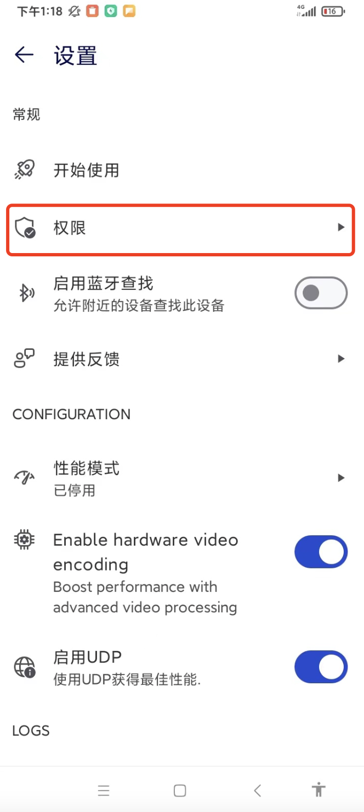

# 远程控制手机一站式解决方案

  

作者：iclause  
联系方式：809016408@qq.com     

- [远程控制手机一站式解决方案](#远程控制手机一站式解决方案)
- [一、账号注册](#一账号注册)
- [二、软件下载与使用](#二软件下载与使用)
  - [1、主控制端（支持手机，电脑）](#1主控制端支持手机电脑)
  - [2、被控制端（手机）:](#2被控制端手机)

   
# 一、账号注册
   注册地址
   
   https://account.teamviewer.com/register?redirect_uri=https%3A%2F%2Fweb.teamviewer.com%2Fauthenticate%2Fwithtoken

   注册成功后，保存好您的账户信息（电子邮箱，密码）
   

# 二、软件下载与使用
   

## 1、主控制端（支持手机，电脑）
 TeamViewer full client软件是主控制端所需软件，请根据您的主控制端设备类型进行选择
    
1.1 Android手机

   https://www.teamviewer.cn/cn/download/android/
    
   找到如图所示，点击下载（不同系统版本手机可能会提示软件风险，选择允许安装）
   

1.2 iOS手机

   https://www.teamviewer.cn/cn/download/ios/

   找到如图所示，跳转appstore下载最新版本并安装
   

1.3 Windows电脑

   https://www.teamviewer.cn/cn/download/windows/

   找到如图所示，点击下载并安装
   

1.4 Mac电脑

   https://www.teamviewer.cn/cn/download/macos/
   
   找到如图所示，点击下载并安装
   

 下载并安装成功后，可使用“步骤一”注册的账号登录，首次登录时会提示信任设备，使用注册的邮箱验证添加信任设备即可（根据提示操作即可，如果这步无法成功请与我联系）

## 2、被控制端（手机）:

2.1 Android
   
   如果被控制端是Android系统，需要下载TeamViewer QuickSupport,TeamViewerUniversal Add-On,TeamViewer Host这三个软件
   
   下载地址 https://www.teamviewer.cn/cn/download/android/

   按照以下步骤依次下载安装软件（截图为红米9A测试，其他厂商安卓手机原理类似，如有问题请留言）

   

   2.1.1 TeamViewer QuickSupport

    找到如图所示，点击下载，并安装（不同系统版本手机可能会提示软件风险，选择允许安装）

   

   2.1.2 AddOn插件下载与激活
     
    addon插件需要使用QuickSupport软件辅助下载并激活

   2.2.2.1 下载安装
   - 打开QuickSupport软件
    
     
   - 点击右上角设置
    
     
   - 点击权限
    
     

   - 点击远程控制功能
    
    

   - 点击安装TeamViewer增值模块，安装成功后进行下一步
    
    
    
    
    
   2.1.2.2 激活

   - 点击启用Universal Add-On
    
    

   - 点击无障碍功能菜单
    
    

   - 选择开启，然后点击返回
    
    

   - 点击已下载的服务
    
    

   - 点击开启服务
    
    

   - 选中“我已知晓....”,点击确定
    
    

    至此Add-On已激活

   2.1.3 TeamViewer Host

   - 找到如图所示，点击下载（不同系统版本手机可能会提示软件风险，选择允许安装）
     
    

   - 打开Host软件， 打开一切提示所需的开关，权限。
     
      
      
      
      登录“步骤一”注册的账号，首次登录需要邮箱认证，添加信任设备（根据提示操作即可，如无法登录请联系我）
      

  
   - 此时打开“步骤二-1”中的主控制端设备（前提：主控制端账号已登录），即可看到被控制端设备
     
      

     点击我的托管设备，正常可以看到被控制端设置。（如果里面为空也可以打开我的计算机进行查看）

     

     点击连接图标

     

   - 查看被控制端设备，提示“Host将开始截取屏幕内容”，点击立即开始，此时远程控制已建立，主控端可以看到并操作被控端屏幕。
     
      

   2.1.4 权限配置
   
   被控制端为Android手机需设置以下权限，才能保证被控制端一直长期可以建立连接。否则会因为操作系统策略导致软件服务被杀死。

- 开启软件所需权限（以红米9A手机为例）
    
  设置-应用设置-应用管理 （不同Android厂商叫法不同，如找不到可根据经验寻找设置-应用管理模块）
     
     
     

   - 搜索host，点击进入
       
        

        开启自启动开关

        

        下滑页面，找到省电策略，点击进入，选择“无限制”模式

        
        

   - 搜索add，点击进入TeamViewer Universal Add-On
       
         

        开启自启动开关

        

2.2 iOS：
   - 如果被控制端是IOS，仅需下载TeamViewer QuickSupport
   
     

   - 打开TeamViewer QuickSupport初始化成功后有您的ID
    
     
     

   - 此时使用“步骤二-1”中的主控制端设备添加该ID即可进行连接，
     打开主控制端TeamViewer软件

     

     点击我的计算机

     

     添加计算机

     
     

     点击连接标志

     

   - 打开被控制端QuickSupport软件，会提示授权 
    
     
     

   - 此时远程控制已建立，主控端可以看到并操作被控端屏幕
    
     

    注意：iOS设备作为被控制端，每次连接必须被由被控制端授权同意，否则无法在未授权的情况建立连接（推荐使用Android设备作为被控制端，部署好后可随时进行连接实现远程控制，无需每次人工进行授权操作）

